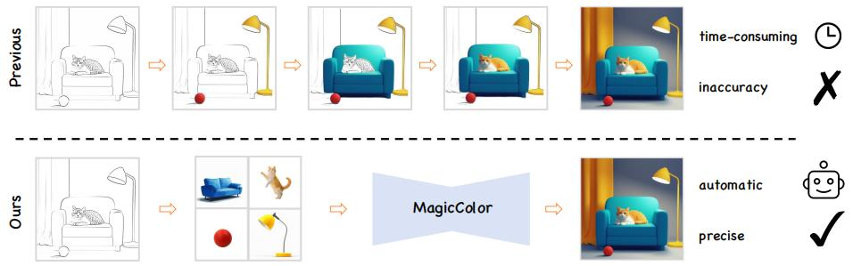
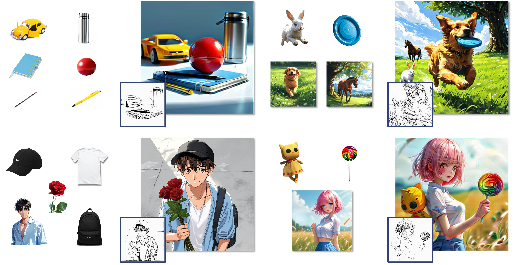

# MagicColor: Multi-Instance Sketch Colorization
[](https://yinhan-zhang.github.io/color/)
[](https://arxiv.org/abs/2503.16948)
[](https://creativecommons.org/licenses/by-nc/4.0/)


# News
- 2025-06-27 : release model weight ✅
- 2025-03-24 : release code ✅

## Overview
We present MagicColor, a diffusion-based framework for multi-instance sketch colorization. Previous methods can only achieve multi-instance sketch colorization step by step, which is time-consuming and inaccurate. In contrast, our method has the capability of coloring sketches while maintaining consistency, making multi-instance sketch colorization easier.



### Gallery
Given a set of reference instances and corresponding line art images, our approach enables coloring sketches while maintaining consistency across multiple instances. Compared to traditional methods, our approach significantly improves coloring efficiency.




## Set up

### Environment

    conda create -n MagicColor python=3.8

    pip install -r requirements.txt

### Repository

    git clone https://github.com/YinHan-Zhang/MagicColor.git
    
    cd MagicColor

Use tools to automatically extract masks:

    git clone https://github.com/IDEA-Research/Grounded-Segment-Anything.git

Install Grounded-Segment-Anything see here -> [install guideline](https://github.com/IDEA-Research/Grounded-Segment-Anything)

    mv automatic_label.py Grounded-Segment-Anything/

    cd Grounded-Segment-Anything

    mkdir ckpt  
    
    # move sam/ram/groundingdino weight to ckpt dir


Then, you can train the model on your dataset:

    python automatic_label.py \
        --config GroundingDINO/groundingdino/config/GroundingDINO_SwinT_OGC.py \
        --ram_checkpoint ./ckpt/ram_swin_large_14m.pth \
        --grounded_checkpoint ./ckpt/groundingdino_swint_ogc.pth \
        --sam_checkpoint ./ckpt/sam_vit_h_4b8939.pth \
        --data_dir  ./data \
        --output_dir ./data_res \
        --box_threshold 0.15 \
        --text_threshold 0.15 \
        --iou_threshold 0.15 \
        --device "cuda"

### Download pre-trained weights

    bash download.sh

The downloaded checkpoint directory should have the following structure:
```
-- ckpt
    |-- stable-diffusion-v1-5
    |-- clip-vit-large-patch14
    |-- controlnet
        |-- config.json
    |-- Annotators
        |-- sk_model.pth
    |-- controlnet_lineart
        |-- diffusion_pytorch_model.safetensors
    |-- MagicColor
        |-- controlnet_multi
            |-- diffusion_pytorch_model.safetensors
        |-- controlnet_sketch
            |-- diffusion_pytorch_model.safetensors
        |-- denoising_unet.pth
        |-- reference_unet.pth
```
- move dino checkpoint 
```mv dinov2_vitl14_reg4_pretrain.pth ./src/models```

### Dataset(optional)

- [Sakuga Dataset](https://github.com/KytraScript/SakugaDataset): Large scale Animation Dataset
- [ATD-12K](https://github.com/lisiyao21/AnimeInterp): image triple pair data
- [Anime-sketch-colorization-pair](https://www.kaggle.com/datasets/ktaebum/anime-sketch-colorization-pair): sketch-image pair data
- [Coconut dataset](https://www.kaggle.com/datasets/xueqingdeng/coconut): Due to the difficulty in collecting anime annotation data, we borrowed the annotation segmentation data of coconut as auxiliary training data

Due to the limitations of computing resources and data, the amount of animation data for model training is limited. If you are not satisfied with the colorization effect and have enough computing resources, you can train the model yourself based on the provided checkpoint.

- Computing resource needs: Training is available on RTX 4090 (bf16) and A100 80GB (fp32).

### Train
Dataset Format:

    data/
    ├── dir_name1
        ├──masks/
            ├── mask_1.png # instance mask
            ├── mask_2.png
            ├── ...
            ├── mask_n.png

        ├── dir_name1.jpg # origin image 1

    ├── dir_name2
        ├──masks/
            ├── mask_1.png # instance mask
            ├── mask_2.png
            ├── ...
            ├── mask_n.png

        ├── dir_name2.jpg # origin image 2

then,

    cd scripts

    bash multi_ref_train.sh

### Inference
Dataset Format:

    data/
    ├── dir_name
        ├──masks/
            ├── mask_1.png # reference mask
            ├── mask_2.png
            ├── ...
            ├── mask_n.png

        ├── dir_name_1.jpg # reference instance
        ├── dir_name_2.jpg
        ├── ...
        ├── dir_name_n.jpg

        ├── dir_name.jpg  # sketch image

then, 

    cd scripts
    
    bash multi_ref_infer.sh # modify input_data_dir


### Interface
run the script:
 
    cd inference
    python gradio_app.py


## Limitation

Due to the limitations of computing resources and data, the amount of data for model training is limited. If you have enough computing resources, you can train the model yourself.

## Acknowledgement

Thanks for the reference contributions of these works: 
- MangaNinjia
- ColorizeDiffusion
- DreamBooth
